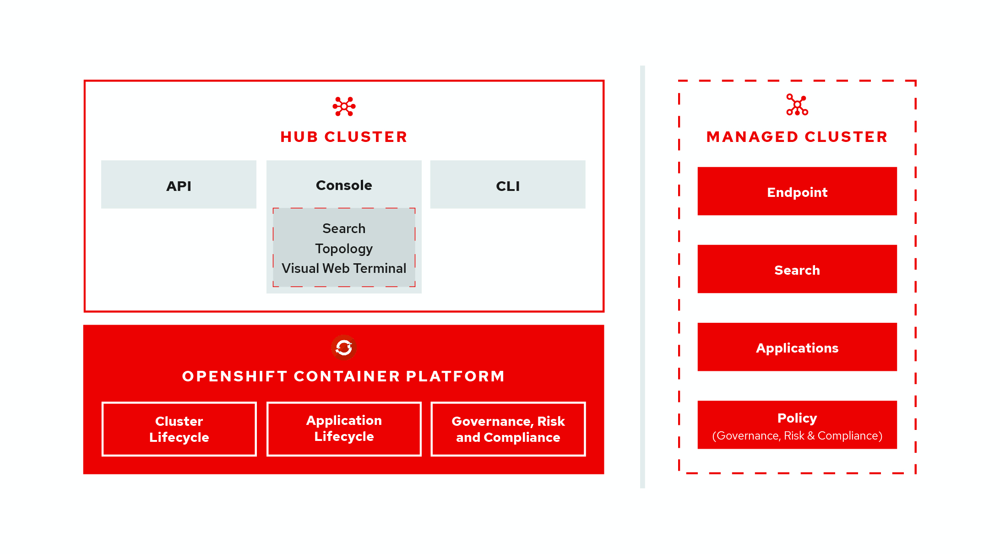

---

copyright:
  years: 2020
lastupdated: "2020-04-06"

---

# Multicluster architecture

Red Hat Advanced Cluster Management for Kubernetes consists of several multicluster components, which are used to access and manage your clusters. Learn more about the following components for Red Hat Advanced Cluster Management for Kubernetes:

  - [Hub cluster](#hub-cluster)
  - [Managed cluster](#managed-cluster)
  - [Cluster lifecycle](#cluster-lifecycle)
  - [Application lifecycle](#application-lifecycle)
  - [Governance risk and compliance](#Governance-risk-and-compliance)

## Hub cluster

The hub cluster is the common term that is used to define the central controller that runs in a Red Hat Advanced Cluster Management for Kubernetes cluster. From the hub cluster, you can access the console and components found on that console, as well as APIs such as the `rcm-api`, which handles API requests related to cluster lifecycle management.

The hub cluster aggregates information from multiple clusters by using an asynchronous work request model. With a graph database, the hub cluster maintains the state of clusters and applications that run on it. The hub cluster also uses `etcd`, a distributed key value store, to store the state of work requests and results from multiple clusters and provides a set of REST APIs for the various functions that it supports.

## Managed cluster

The managed cluster is used to define the Red Hat Advanced Cluster Management for Kubernetes `multicluster-endpoint`, which is the agent that is responsible for a single Kubernetes cluster. The managed cluster initiates a connection to the hub cluster, receives work requests, applies work requests, then returns the results. The managed cluster connects to various services within the cluster for operations, including the Kubernetes API service, and Weave for topology.

See [Managing your clusters](../manage_cluster/intro.md) for to learn how to create and import clusters, which is part of _Cluster lifecycle_.

## Cluster lifecycle

Create, import, and manage clusters across public and private clouds. From the console, you can view cluster health status, for instance, then you can move toward creating applications on those clusters.

## Application lifecycle

After you configure a Red Hat Advanced Cluster Management for Kubernetes hub cluster and a managed cluster, you can view and deploy applications with application resources. Your _Application_ is used to only _view_ your resource, while other application resource examples are for deployment. A multi-cluster application uses a Kubernetes specification, but with additional automation of the deployment and lifecycle management of resources to individual clusters.

See [Managing applications](../manage_applications/overview.md) for more application topics.

## Governance risk and compliance

After you configure a Red Hat Advanced Cluster Management for Kubernetes hub cluster and a managed cluster, you can view and create policies for Red Hat Advanced Cluster Management for Kubernete with templates from the _Governance and risk_ page. For more information see, [Red Hat Advanced Cluster Management for Kubernetes Governance and risk](../governance/compliance_intro.md).

See [Red Hat Advanced Cluster Management for Kubernetes installation](../install/overview.md) to prepare your cluster and get configuration information.
